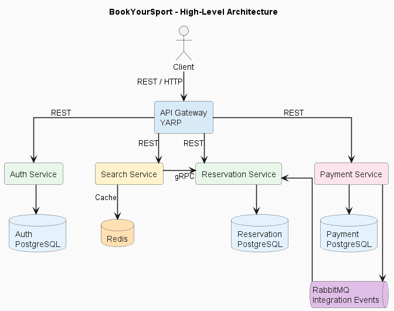

# BookYourSport Architecture

## 1. Architecture Overview

BookYourSport is designed as a microservice-based application in which the main business areas are separated into independent backend services.

The system consists of four main microservices:

- **Auth Service** – authentication, authorization and user management;
- **Reservation Service** – clubs, courts, working hours and reservations;
- **Payment Service** – credit accounts, payments, refunds, subscriptions and contracts;
- **Search Service** – searching and retrieving sports facility information.

An **API Gateway** based on YARP provides a single entry point for external clients and routes requests to the appropriate backend service.

Each service is responsible for its own business logic and data.

---

## 2. High-Level Architecture

The following diagram presents the main components of the BookYourSport system and communication between them.

The architecture separates the main business domains into independent services. External clients access backend functionality through the API Gateway, while services communicate directly when internal communication is required.

---

## 3. API Gateway

The API Gateway represents the external entry point to the BookYourSport backend.

The project uses **YARP (Yet Another Reverse Proxy)** to route incoming HTTP requests to the appropriate microservice.

Instead of requiring clients to communicate directly with every backend service, requests are sent through the gateway and forwarded according to the configured routes.

The API Gateway provides:

- a single backend entry point;
- centralized request routing;
- separation between clients and internal service locations;
- easier extension and modification of the backend architecture.

---

## 4. Auth Service

The **Auth Service** is responsible for identity and access management.

Its main responsibilities include:

- user registration;
- user authentication;
- JWT token generation;
- refresh token management;
- user role management;
- authorization;
- Club Owner approval workflow;
- contract status tracking;
- subscription status tracking.

The service stores its persistent data in its own **PostgreSQL database**.

The application supports three main user roles:

- Player;
- Club Owner;
- Administrator.

This service represents the central authority for user identity and permissions within the system.

---

## 5. Reservation Service

The **Reservation Service** contains the core business logic related to sports facilities and reservations.

Its responsibilities include:

- sports club management;
- tennis court management;
- club working hours;
- court pricing;
- reservation creation;
- reservation availability validation;
- reservation rescheduling;
- reservation cancellation.

The Reservation Service is the authoritative source of information about clubs, courts and reservations.

Its persistent data is stored in a dedicated **PostgreSQL database**.

---

## 6. Search Service

The **Search Service** provides functionality for searching sports facilities and retrieving information required by search clients.

Instead of directly accessing the Reservation Service database, the Search Service communicates with the Reservation Service using **gRPC**.

This preserves microservice boundaries because the Reservation Service remains responsible for its own data.

The Search Service also uses **Redis** for caching.

Caching reduces unnecessary repeated requests and improves the performance of frequently executed search operations.

---

## 7. Payment Service

The **Payment Service** is responsible for financial and subscription-related functionality.

Its responsibilities include:

- credit account management;
- credit top-ups;
- reservation charges;
- refunds;
- transaction history;
- Club Owner subscription payments;
- subscription contract generation;
- PDF contract generation and storage.

Payment-related persistent information is stored in a dedicated **PostgreSQL database**.

The service also implements an **Outbox pattern** for reliable publication of integration events.

---

## 8. Communication Between Services

BookYourSport uses different communication mechanisms depending on the type of interaction.

### 8.1 REST / HTTP

REST is used for external communication with backend services through the API Gateway.

Client applications send HTTP requests to the gateway, which forwards them to the appropriate microservice.

REST is used for operations such as:

- authentication;
- user management;
- reservation management;
- club management;
- payment operations;
- contract operations.

### 8.2 gRPC

**gRPC** is used for synchronous internal communication between the Search Service and Reservation Service.

The Search Service can request reservation-domain information without directly accessing the Reservation Service database.

This keeps the services independent while still allowing efficient synchronous communication.

### 8.3 RabbitMQ

**RabbitMQ** is used for asynchronous communication between the Payment Service and Reservation Service.

The Payment Service publishes integration events, while the Reservation Service consumes the events relevant to its business processes.

This approach reduces direct coupling between the services for operations that do not require an immediate synchronous response.

---

## 9. Data Storage

BookYourSport follows the principle that each microservice owns and manages its own data.

| Component | Storage |
| --- | --- |
| Auth Service | PostgreSQL |
| Reservation Service | PostgreSQL |
| Payment Service | PostgreSQL |
| Search Service | Redis cache |

A microservice does not directly access another microservice's database.

Communication across service boundaries is performed through defined APIs or messaging mechanisms.

This prevents database-level coupling between independently developed services.

---

## 10. Internal Service Architecture

Backend services follow a layered structure inspired by **Domain-Driven Design (DDD)**.

The main layers are:

### Domain

The Domain layer contains the core business model.

It typically contains:

- entities;
- value objects;
- enumerations;
- domain rules;
- repository abstractions.

The Domain layer does not depend on infrastructure technologies.

### Application

The Application layer contains application use cases and coordinates domain operations.

It typically contains:

- commands;
- handlers;
- application services;
- interfaces;
- DTOs.

Some parts of the system use a command/handler approach inspired by **CQRS**.

### Infrastructure

The Infrastructure layer contains technical implementations required by the application.

Examples include:

- database repositories;
- Entity Framework Core persistence;
- external service clients;
- RabbitMQ integration;
- Redis integration;
- PDF document generation.

### API

The API layer exposes application functionality to external or internal clients.

It is responsible for:

- HTTP controllers;
- gRPC endpoints where applicable;
- dependency injection configuration;
- middleware configuration;
- application startup.

---

## 11. Reliability and Integration

The architecture includes mechanisms designed to improve reliability between independently running services.

### Outbox Pattern

The Payment Service uses the **Outbox pattern** when publishing integration events.

Instead of relying on a database operation and message publication as two completely independent operations, events are first stored as outbox messages.

They can then be published to RabbitMQ and marked as processed.

This reduces the risk of losing integration events when failures occur between persistence and message publication.

### Caching

The Search Service uses Redis to cache frequently requested data.

This reduces the number of repeated requests to other services and improves response times for search operations.

---

## 12. Containerization

The BookYourSport backend is containerized using **Docker**.

Individual services and their infrastructure dependencies can run in separate containers.

Docker Compose configurations are used to define and start the required components, including:

- backend services;
- PostgreSQL databases;
- Redis;
- RabbitMQ;
- API Gateway.

Containers communicate through the configured Docker network.

Service names can therefore be used for communication between containers instead of relying on host-specific addresses.

---

## 13. Architectural Principles

The BookYourSport architecture follows several important principles:

- separation of business domains into independent microservices;
- independent ownership of persistent data;
- separation of domain logic from infrastructure concerns;
- API Gateway as the external entry point;
- REST for external communication;
- gRPC for efficient synchronous internal communication;
- asynchronous messaging for loosely coupled integration;
- caching for frequently requested search data;
- reliable event publication using the Outbox pattern;
- containerized execution using Docker.

These principles allow individual parts of the application to evolve independently while maintaining clearly defined boundaries.

---

## 14. Summary

BookYourSport combines REST, gRPC and asynchronous messaging within a microservice architecture.

External clients communicate with the system through the YARP API Gateway. Auth, Reservation, Payment and Search services encapsulate separate areas of the application's business logic and manage their own data.

The Reservation Service acts as the authoritative source for sports facilities and reservations, while the Search Service accesses required information through gRPC and improves performance using Redis caching. Payment-related integration with the Reservation Service is performed asynchronously through RabbitMQ.

The resulting architecture provides clear separation of responsibilities and supports independent development, deployment and evolution of individual services.