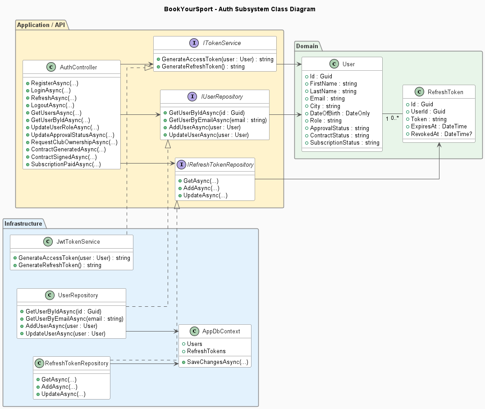
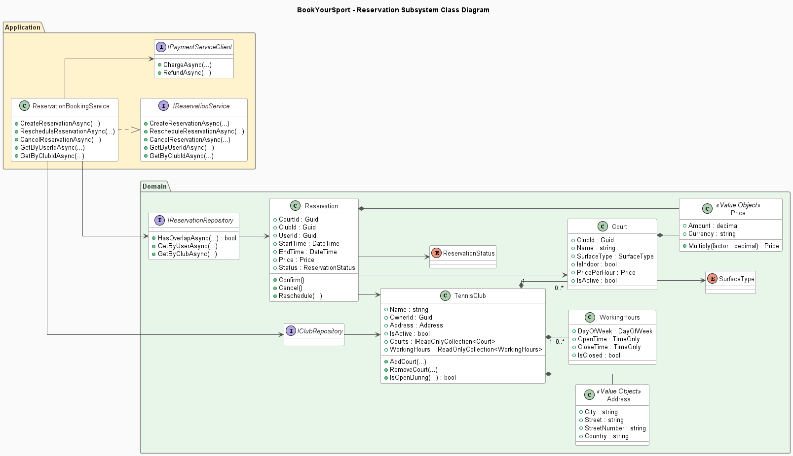
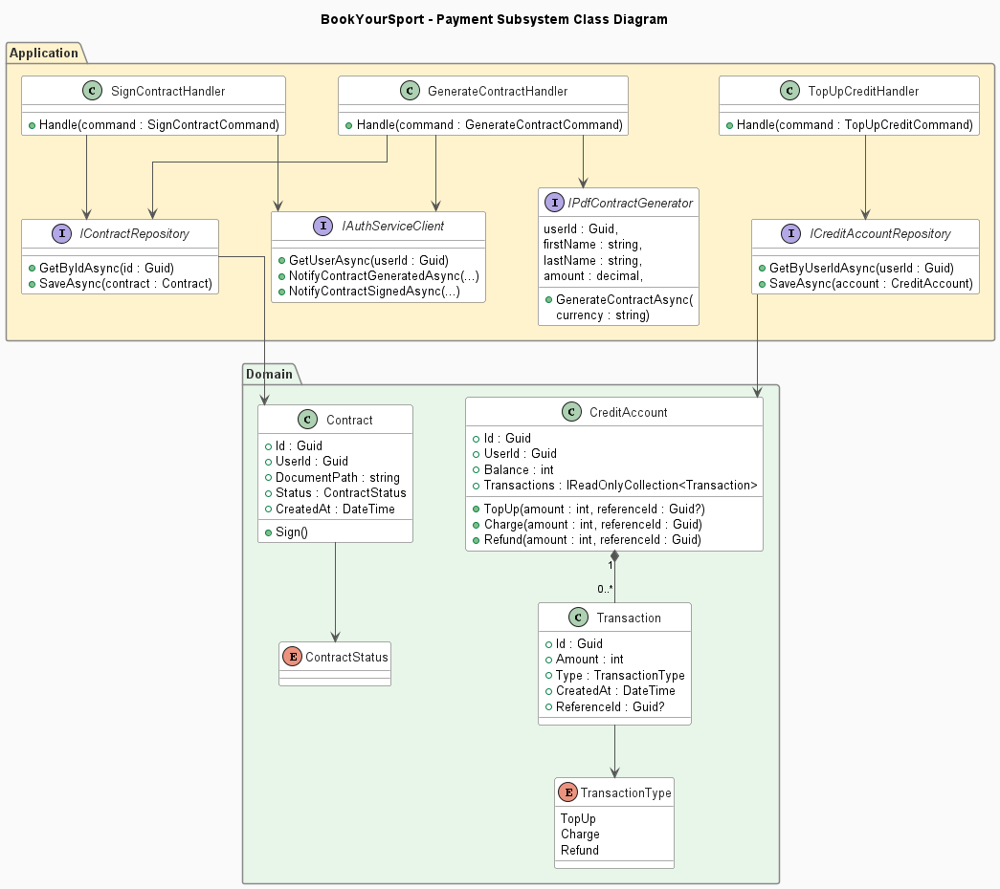
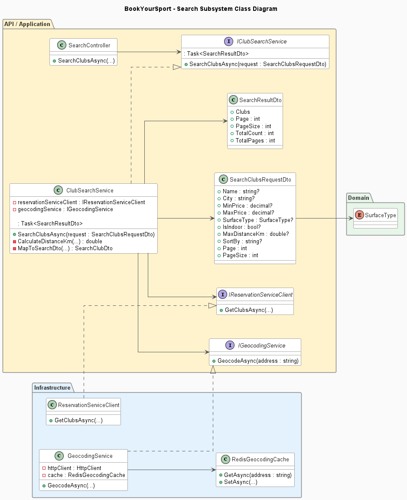

# BookYourSport Class Diagrams

## 1. Overview

BookYourSport is organized as a microservice-based application consisting of four main backend services:

- **Auth Service**
- **Reservation Service**
- **Payment Service**
- **Search Service**

Each service is responsible for a separate business area and follows a layered organization that separates application logic, domain concepts and infrastructure concerns.

The following diagrams present the most important classes, interfaces and relationships within each subsystem.

---

## 2. Auth Service

The Auth Service is responsible for user registration, authentication, authorization and user account management.

It also manages the Club Owner approval process and tracks contract and subscription status.

The main components are:

- **AuthController** – exposes authentication and user-management operations.
- **IUserRepository** – defines persistence operations for users.
- **IRefreshTokenRepository** – manages refresh tokens.
- **ITokenService** – defines JWT access and refresh token generation.
- **User** – represents the main user entity.
- **RefreshToken** – represents refresh tokens associated with users.
- **UserRepository** – provides the concrete user persistence implementation.
- **RefreshTokenRepository** – provides the concrete refresh-token persistence implementation.
- **JwtTokenService** – implements JWT access and refresh token generation.
- **AppDbContext** – Entity Framework Core database context used by the service.

The API/Application layer depends on abstractions, while the Infrastructure layer provides their concrete implementations.

---

## 3. Reservation Service

The Reservation Service contains the core booking domain of the BookYourSport application.

It manages tennis clubs, courts, working hours and reservations.

The central domain components are:

- **TennisClub** – represents a sports club and contains its courts and working hours.
- **Court** – represents an individual court belonging to a club.
- **Reservation** – represents a reservation made by a user for a specific court.
- **WorkingHours** – defines the operating hours of a club.
- **Address** – value object representing the club location.
- **Price** – value object representing monetary values used for court pricing and reservations.
- **ReservationStatus** – defines the current state of a reservation.
- **SurfaceType** – defines the supported court surface types.

The **ReservationBookingService** implements the main reservation use cases, including creating, rescheduling and cancelling reservations.

Persistence operations are abstracted through **IReservationRepository** and **IClubRepository**.

The **IPaymentServiceClient** abstraction allows the Reservation Service to communicate with the Payment Service for charge and refund operations without directly depending on its implementation.

---

## 4. Payment Service

The Payment Service manages user credit accounts, financial transactions and Club Owner subscription contracts.

The main domain components are:

- **CreditAccount** – stores the credit balance associated with a user.
- **Transaction** – records operations performed on a credit account.
- **Contract** – represents a Club Owner subscription contract.
- **TransactionType** – distinguishes between top-up, charge and refund transactions.
- **ContractStatus** – represents the current state of a contract.

Application handlers coordinate individual use cases:

- **TopUpCreditHandler** – processes credit top-ups.
- **GenerateContractHandler** – generates a subscription contract for an approved Club Owner.
- **SignContractHandler** – processes contract signing.

The Payment Service communicates with the Auth Service through **IAuthServiceClient**.

PDF subscription contracts are generated through the **IPdfContractGenerator** abstraction.

Persistence is abstracted through **ICreditAccountRepository** and **IContractRepository**, keeping application logic separated from infrastructure concerns.

---

## 5. Search Service

The Search Service provides searching, filtering, sorting and location-based discovery of sports clubs and courts.

The main application component is **ClubSearchService**, which implements **IClubSearchService**.

Search requests can contain criteria such as:

- club name;
- city;
- minimum and maximum price;
- court surface type;
- indoor or outdoor court preference;
- maximum distance;
- sorting criteria;
- pagination parameters.

The **SearchClubsRequestDto** represents the search criteria, while **SearchResultDto** represents the paginated search result.

The Search Service obtains current club and court information from the Reservation Service through **IReservationServiceClient**.

The infrastructure implementation, **ReservationServiceClient**, performs this internal communication using gRPC.

Location-based searches use **IGeocodingService**, implemented by **GeocodingService**.

Geocoding results are cached through **RedisGeocodingCache**, reducing unnecessary repeated requests to the external geocoding service.

The **SurfaceType** enum represents the main domain concept directly used by the Search Service.

---

## 6. Layer Responsibilities

The class diagrams demonstrate the separation of responsibilities between the main architectural layers used throughout the BookYourSport backend.

### Application / API

The Application/API layer exposes application functionality and coordinates business use cases.

Depending on the service, this layer contains:

- controllers;
- application services;
- command handlers;
- interfaces;
- data transfer objects.

Application components depend primarily on abstractions instead of concrete infrastructure implementations.

### Domain

The Domain layer contains the main business concepts of each microservice.

Depending on the service, it contains:

- entities;
- value objects;
- domain enumerations;
- repository abstractions.

The Domain layer represents business rules independently of infrastructure and external communication mechanisms.

### Infrastructure

The Infrastructure layer provides concrete technical implementations required by the application.

These include:

- Entity Framework Core database contexts;
- repository implementations;
- JWT token generation;
- gRPC clients;
- Redis caching;
- external HTTP communication;
- PDF document generation.

This separation keeps business logic isolated from technical implementation details and allows individual microservices to evolve independently.

---

## 7. Subsystem Relationships

Although each microservice owns its business logic and data, some operations require communication between services.

The most important relationships represented by the class diagrams are:

- the **Reservation Service** uses a payment abstraction when reservation operations require charging or refunding a user;
- the **Payment Service** communicates with the Auth Service during Club Owner contract and subscription workflows;
- the **Search Service** retrieves current club and court information from the Reservation Service through gRPC;
- the **Search Service** uses geocoding and Redis caching to support location-based searches.

These relationships allow the services to collaborate while maintaining clear boundaries between their respective business domains.
